# Pedido de Compra
### Pega Constellation - Infinity Version 25.1.2

Esta apresentação demonstra o fluxo completo do Pedido de Compra, desde a criação até a aprovação e conclusão do processo.

## Definição

- Gerencia o processo de **solicitação**, **validação** e **aprovação** de compras.
- Aplica **regras de negócio** para aprovação automática ou gerencial.
- Controla **status**, **valores** e **justificativas** do pedido.

## Case Type – Pedido de Compras

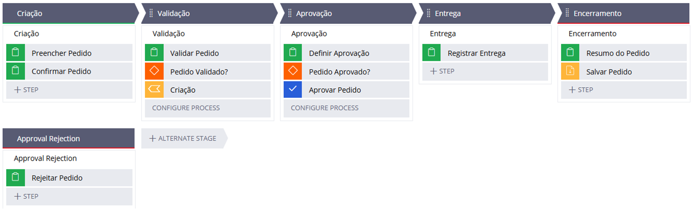

## Flows

#### Criação
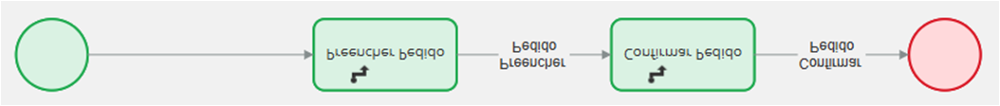

#### Validação
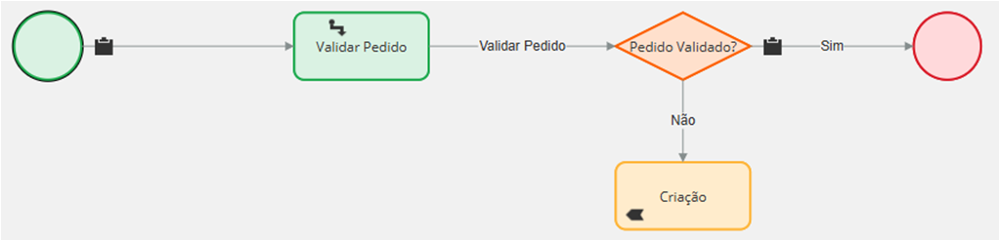

#### Aprovação
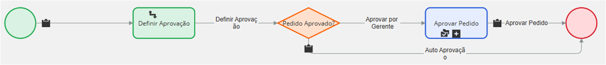

#### Approval Rejection
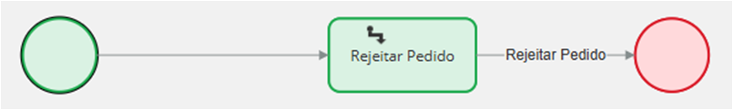

#### Entrega
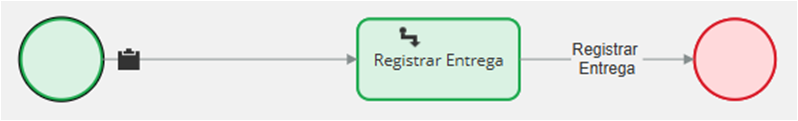

#### Encerramento
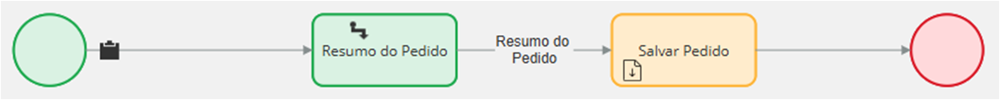

## Data Page – Itens de Pedido
- Utiliza uma **propriedade Query** para recuperar os itens salvos em registro.
- Lista os itens automaticamente no **Tab “Itens de Pedido”** do Case.
- Permite **visualização e conferência** dos itens adicionados ao pedido.
- Garante acesso **centralizado e consistente** aos dados persistidos.

## Data Page – Itens de Pedido (Query)
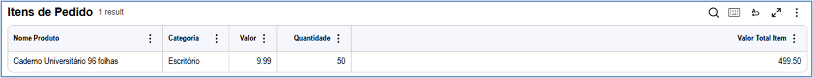
- Lista automaticamente os **itens vinculados ao contexto do Case**.
- Disponibiliza os dados para **exibição e cálculos** no pedido.
- Centraliza o acesso aos itens persistidos de forma reutilizável.

## Aprovação Automática e Gerencial
- **Aprovação automática** quando o valor total do pedido está dentro do limite definido.
- **Aprovação pelo gerente** quando o valor ultrapassa o limite permitido.
- **Registro do status** do pedido conforme o resultado da aprovação.

## Step Preencher Pedido
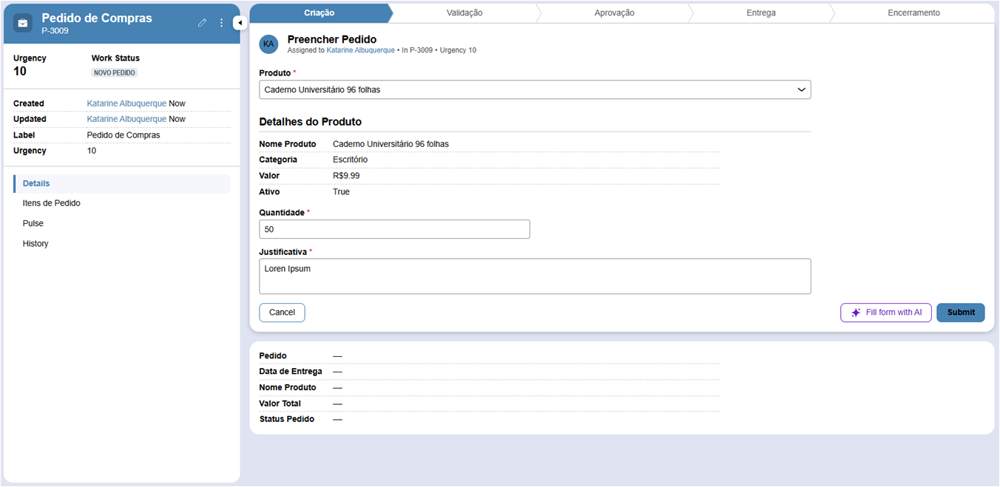
- O Produto é selecionado para o pedido,
- A quantidade é informada,
- É definida uma Justificativa para relalizar o pedido.

## Step Confirmar Pedido
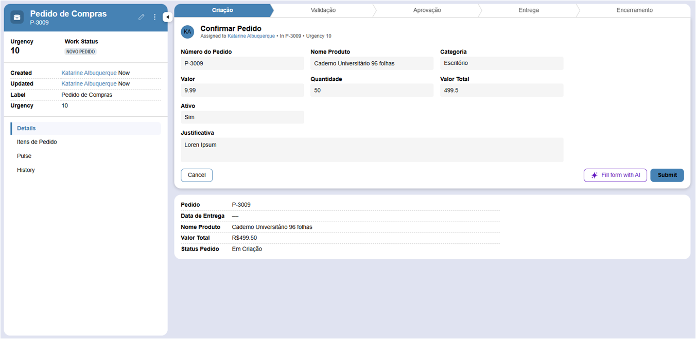
- Exibe os dados atualizados,
- Exibe o cálculo do valor total da compra.

## Step Validar Pedido
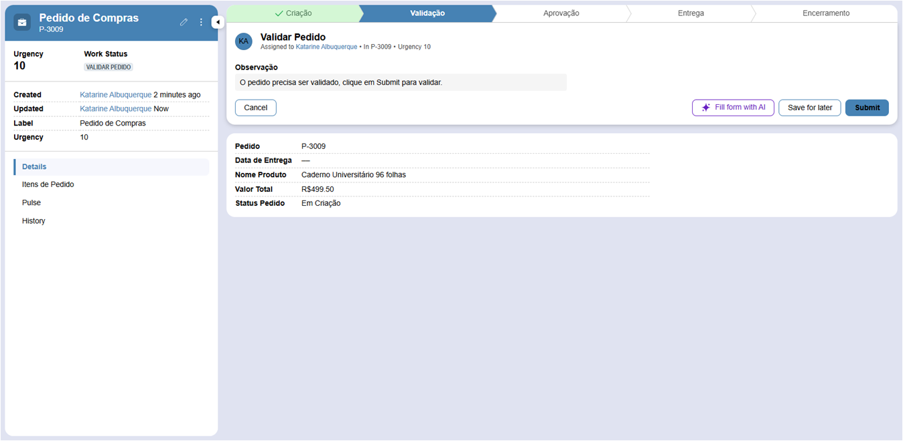
- Para validar é preciso avançar o case.

## Step Definir Aprovação
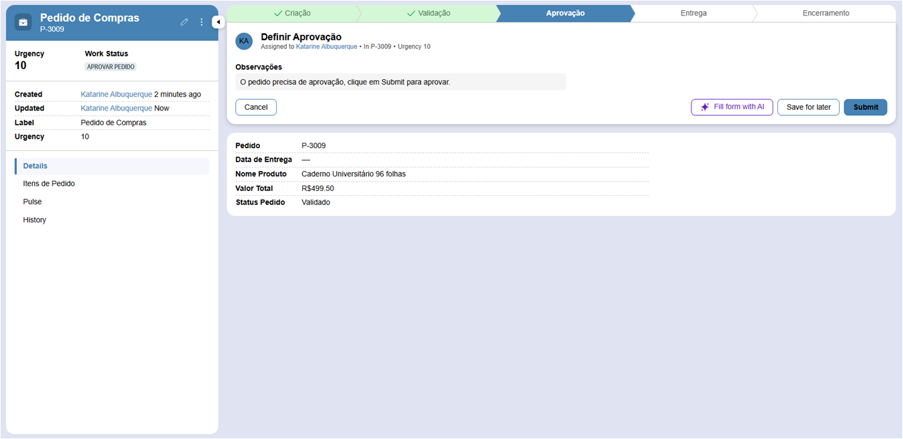
- Para aprovar é preciso avançar o case.

## Step Registrar Entrega
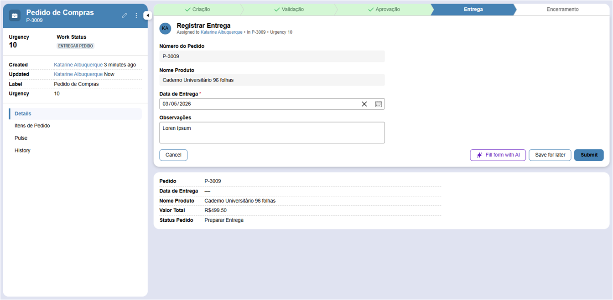
- Registra a data para a entrega,
- Define observações para realizar a entrega.

## Step Resumo do Pedido
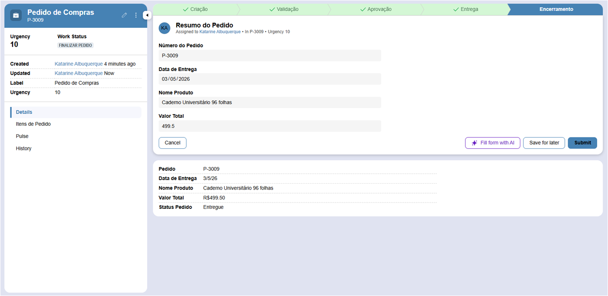
- Exibe o resumo do pedido.

## Encerramento
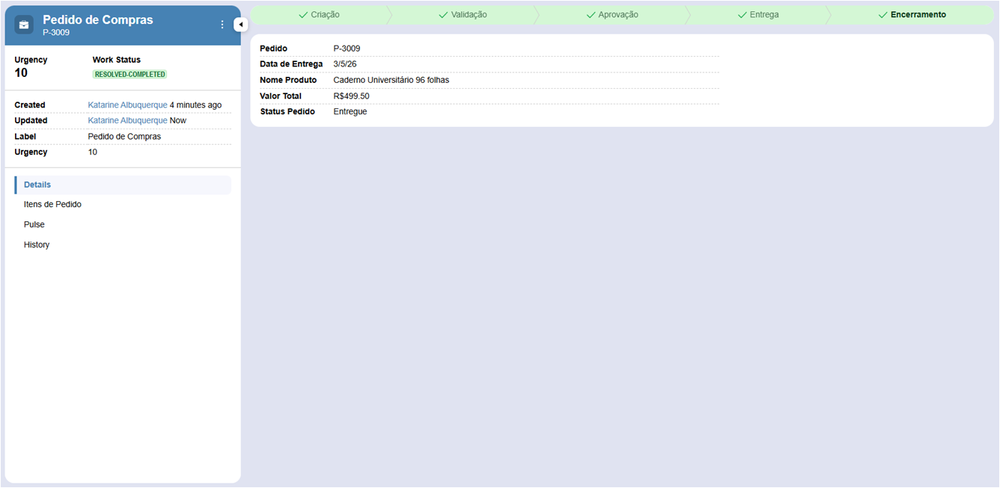
- Processo encerrado com um breve resumo de visualização.

## Tab - Itens de Pedido
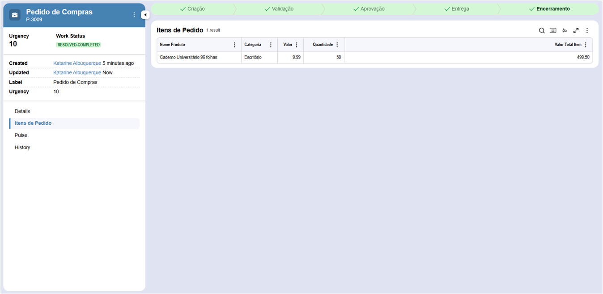
- Exibe os dados registrados da Data Page Itens de Pedido,
- Tabela da propriedade do tipo Query (List records).

## Contatos

- E-mail: [kba.2879@gmail.com](mailTo:kba.2879@gmail.com)

- Linkedin: [/katarine-albuquerque](https://www.linkedin.com/in/katarine-albuquerque/)